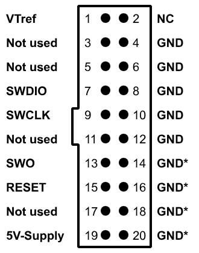
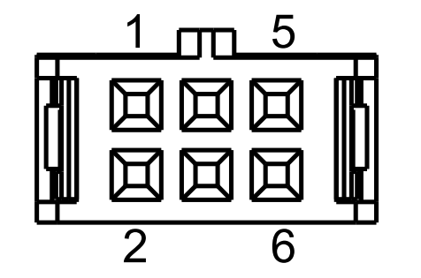

# CAN_IO_Expander

This software is written on a STM32F072C8Tx. It contains 3 branches. 

The Main Branch is for the standard program. It is has no EXTI interrupts and is definitely working. Use this if you don't want the EXTI options.

## Compilation

To compile the program use [Keil](https://www.keil.com/download/product/), or alternatively a Keil extension on any preferred IDE. 

To upload and debug the program use [Ozone](https://www.segger.com/products/development-tools/ozone-j-link-debugger/). The board must be on to be able to do this.

### Wire Pins:  
- GND - Cable Pin 3
- SWCLK - Cable Pin 5
- SWDIO - Cable Pin 4  



### Flash
1. Select new Project wizard
2. Device is **STM32F072C8**
3. Register set **Cortex-M0**
4. Target Interface **SWD**
5. Target Interface Speed **4 MHz**
6. Host Interface **USB**
7. Select the generated **axf** binary file
8. **Finish**

## Usage

There are multiple commands that can be used to configure the desired outcome.
- Port can be A, B, C
- Pin can be form 0 to F

### Main

**Set Pin direction -- AA**
```C
CAN_RxData[1] = Port/Pin
```
**Set Pin output -- AB**
```C
CAN_RxData[1] = Port/Pin
CAN_RxData[2] = PinState
``` 
**Read Pin -- AC**
```C
CAN_RxData[1] = Port/Pin
CAN_response_data[0] = PinState
```
**Set alternate pin functions -- AD**
```C
CAN_RxData[1] = Port/Pin
CAN_RxData[1] = Pin Function / Take from table below
```
|      | AF0       | AF1       | AF2       | AF4       | AF5       |
| ---- | --------- | --------- | --------- | --------- | --------- |
| PA0  |           |           |           | USART4_TX |           |
| PA1  |           |           | TIM2_CH2  | USART4_RX |           |
| PA2  | TIM15_CH1 | USART2_TX | TIM2_CH3  |           |           |
| PA3  | TIM15_CH2 | USART2_RX | TIM2_CH4  |           |           |
| PA4  |           |           |           | TIM14_CH1 |           |
| PA6  |           | TIM3_CH1  |           |           | TIM16_CH1 |
| PA7  |           | TIM3_CH2  |           | TIM14_CH1 | TIM17_CH1 |
| PA8  |           |           | TIM1_CH1  |           |           |
| PA9  |           | USART1_TX | TIM1_CH2  |           |           |
| PA10 |           | USART1_RX | TIM1_CH3  |           |           |
| PA11 |           |           | TIM1_CH4  | CAN_RX    |           |
| PA12 |           |           |           | CAN_TX    |           |
| PA14 |           | USART2_TX |           |           |           |
| PA15 |           | USART2_RX |           |           |           |
| PB0  |           | TIM3_CH3  |           |           |           |
| PB1  | TIM14_CH1 | TIM3_CH4  |           |           |           |
| PB3  |           |           | TIM2_CH2  |           |           |
| PB4  |           | TIM3_CH1  |           |           |           |
| PB5  |           | TIM3_CH2  |           |           |           |
| PB6  | USART1_TX |           |           |           |           |
| PB7  | USART1_RX |           |           |           |           |
| PB8  |           |           | TIM16_CH1 | CAN_RX    |           |
| PB9  |           |           | TIM17_CH1 | CAN_TX    |           |
| PB10 |           |           | TIM2_CH3  | USART3_TX |           |
| PB11 |           |           | TIM2_CH4  | USART3_RX |           |
| PB14 |           | TIM15_CH1 |           |           |           |
| PB15 |           | TIM15_CH2 |           |           |           |

**Set timer frequency -- BA**
```C
CAN_RxData[1] = Timer
CAN_RxData[2] = Frequency Part 1
CAN_RxData[3] = Frequency Part 2
CAN_RxData[4] = Frequency Part 3
```
**Set duty cycle -- BB**
```C
CAN_RxData[1] = Timer
CAN_RxData[2] = Channel
CAN_RxData[3] = Duty Cycle
```
**Set timer on time -- BC**
```C
CAN_RxData[1] = Timer
CAN_RxData[2] = Channel
CAN_RxData[3] = Uptime Part 1 in us
CAN_RxData[4] = Uptime Part 2 in us
```
**Read UART buffer -- CA**  
The ID is extended so it requires a Data field this long
```C
CAN_RxData[1] = UART Nummer
CAN_response_data = UART Buffer
```  
**Change CAN ID -- DA**
```C
CAN_RxData[1] = ID Part 1
CAN_RxData[2] = ID Part 2
CAN_RxData[3] = ID Part 3
CAN_RxData[4] = ID Part 4
```  
**Disable USB -- E0**
```C
CAN_RxData[0] = E0
```  
**Enable USB -- E1**
```C
CAN_RxData[0] = E1
```  

### EXTI

EXTI has all the previous settings, plus a few specialized ones

**EXTI Enable -- F0**
```C
CAN_RxData[1] = 1 - Enable / 0 - Disable
```  
**EXTI Timer -- FA**
```C
CAN_RxData[1] = Timer
```  
**EXTI Channel -- FB**
```C
CAN_RxData[1] = Channel
```  
**EXTI Duty Cycle -- FC**
```C
CAN_RxData[1] = Duty Cycle
```  
**EXTI Sensor Function -- FD**
```C
CAN_RxData[1] = Sensor 1 Function : Standard = 1
CAN_RxData[2] = Sensor 2 Function : Standard = 2
CAN_RxData[3] = Sensor 3 Function : Standard = 3
```  
**EXTI Sensor Pins -- FE**
```C
CAN_RxData[1] = Sensor 1 Pin : Standard = 0x01
CAN_RxData[2] = Sensor 2 Pin : Standard = 0x0F
CAN_RxData[3] = Sensor 3 Pin : Standard = 0x00
```  
**EXTI All Settings -- FF**
```C
CAN_RxData[1] = Timer
CAN_RxData[2] = Channel
CAN_RxData[3] = Duty Cycle
CAN_RxData[4] & 0xF0 = Sensor 1 Function
CAN_RxData[4] & 0x0F = Sensor 2 Function
CAN_RxData[5] & 0xF0 = Sensor 3 Function
CAN_RxData[5] & 0x0F = Sensor 1 Pin
CAN_RxData[6] & 0xF0 = Sensor 2 Pin
CAN_RxData[6] & 0x0F = Sensor 3 Pin
```  

## Contributors

Andy Tang

Jakob Menzinger
